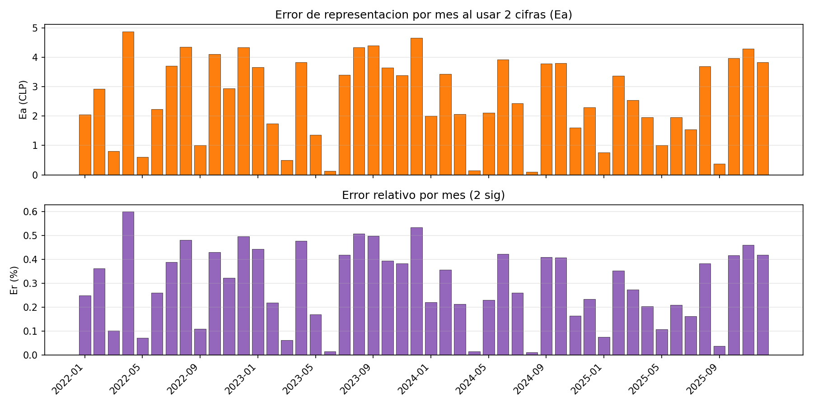
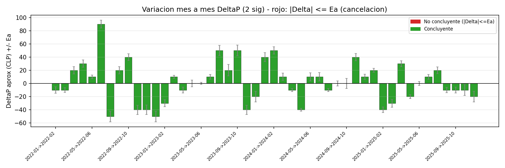
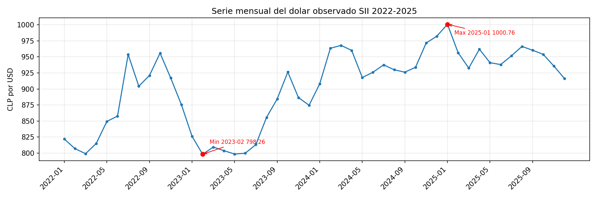
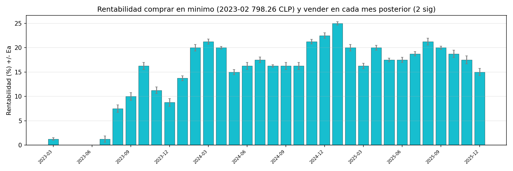
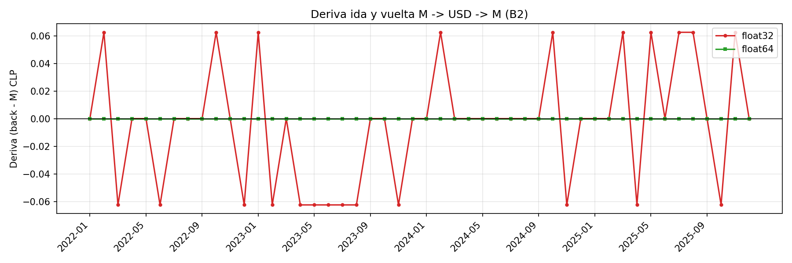

# INFORME — La ganancia que se evapora

**Curso:** Laboratorio Computación Numérica 1 — UCM
**Integrantes:** Marcos Hoces y Rosario Torres
**Tema:** Cancelación y propagación del error con dólar observado SII (2022–2025)  
**Datos:** `data/dolar_observado_sii_2022_2025.csv` (48 meses, 2022-01 a 2025-12)  
**Parámetros oficiales:** 2 cifras significativas totales, base 10, `M = 1.000.000 CLP` (`src/errores.py:10`).  
**Propagación:** `*`/`/` → suma de `Er`, `+`/`-` → suma de `Ea` (`src/errores.py:20`).

> Contradicción detectada: A3 y `src/generar_graficos.py:3` piden 3 cifras. Se toma `SIG=2` como base y se reporta comparación 2 vs 3 en `outputs/*_3sig.csv`.

---

## 1. Definiciones y método

* **Redondeo a N sig:** `round(x / 10^{mag-N+1}) * 10^{mag-N+1}` vectorizado con `numpy` (`src/errores.py:13`). Ej: `963.44→960`, `1000.76→1000`.
* **Error absoluto:** `Ea = |real - aprox|` (`src/errores.py:30`).
* **Error relativo:** `Er = Ea/|real|*100` (`src/errores.py:33`).
* **Propagación compra-venta:** `USD=M/Pcompra` (hereda `Er_compra`), `pesos=USD*Pventa` (`Er=Er_compra+Er_venta → Ea_pesos`), `G=pesos-M` (`Ea_G=Ea_pesos`, `Er_G=Ea_G/|G|*100`), `rent=G/M*100` (`src/errores.py:58`).
* **Propagación resta:** `ΔP=Pf-Pi`, `EaΔ=Ea_f+Ea_i`, `ErΔ=EaΔ/|Δaprox|*100` (`src/errores.py:90`).
* **Norma arbitraria de cancelación (definida para este informe):** si `|Δaprox| ≤ EaΔ` → **no concluyente** (la incertidumbre cubre el cero). Si `|Δaprox| > EaΔ` pero `ErΔ > 50%` → **dudoso** (signo formalmente retenido pero magnitud no fiable). Solo `|Δaprox| ≫ EaΔ` y `ErΔ < 10%` se considera sólido. Esta norma se aplica en `src/errores.py:98` y gráficos.

Carga obligatoria con `np.genfromtxt` (`src/cargar_datos.py:15`).

---

## 2. A1 — Error de representación mes a mes

**Método:** `analisis_A1(sig=2)` redondea los 48 precios y calcula `Ea, Er`.

**Resultados 2 sig (base):**
* Mayor `Er`: **Abril 2022** `815.12 → 820.00 Ea 4.88 Er 0.599%` (`outputs/errores_mensuales_2sig.csv:5`).
* Top 5: Abr22 0.599%, Dic23 `874.67→870 Ea4.67 Er0.534%`, Ago23 `855.66→860 Er0.507%`, Sep23 `884.40→880 Er0.498%`, Dic22 `875.66→880 Er0.496%`.
* Menor `Er`: Ene25 `1000.76→1000 Ea0.76 Er0.076%` (potencia de 10, poco desplazamiento).

**Comparación 3 sig:** mayor `Er` Ene25 `0.076%` (todos <0.08%), demuestra que 3 sig reduce error ~8×.

*Conclusión A1:* Con 2 sig el error relativo mensual es <0.6%, pero suficiente para contaminar diferencias pequeñas.

---

## 3. A2 — Evaluación entre dos puntos (compra-venta)

Se elige un par ilustrativo **Feb-2023 (barato) → Ene-2025 (caro)** con `M=1e6`.

**Con 2 sig:**
* `Pcompra 798.26→800 Ea1.74 Er0.218%`, `Pventa 1000.76→1000 Ea0.76 Er0.076%`
* `USD = 1e6/800 = 1250.00 ±2.72 (Er0.218%)`
* `pesos = 1250*1000 = 1.250.000 ±3674 (Er0.294% = 0.218+0.076)`
* `G = 250.000 ±3674 Er1.47%`, `rent = 25.00% ±0.37`

**Con 3 sig:** `G = 253133 ±1360 Er0.54%`, `rent 25.31% ±0.14` (`outputs/ejemplos_compra_venta.csv:3`).

La ganancia supera 68× su incertidumbre → cálculo bien condicionado.

Otros ejemplos (`outputs/ejemplos_compra_venta.csv`): `2022 mar→jul 799→954` da `rent ~19% ±0.6%` sólido; operaciones con Δ pequeño (ej. meses consecutivos similares) amplifican `Er` en la resta final.

---

## 4. A3 — Cancelación (dos meses casi iguales)

**Caso:** `ΔP = 874.67 (dic23) − 875.66 (dic22) = -0.99`

| SIG | Pini→ | Pfin→ | Δreal | Δaprox | EaΔ | Er vs aprox | Intervalo | Conclusión |
|-----|-------|-------|-------|--------|-----|-------------|-----------|------------|
| 2 | 880 | 870 | -0.99 | **-10.00** | **9.01** | **90.1%** | `[-19.01, -0.99]` | Formalmente `|Δ|>Ea` pero `Er 90%` → **dudoso**; Δaprox 10× mayor que real |
| 3 | 876 | 875 | -0.99 | **-1.00** | **0.67** | **67.0%** | `[-1.67, -0.33]` | `|Δ|>Ea` pero `Er 67%` → dudoso |

**¿Se puede afirmar si subió o bajó?** No con seguridad útil. Ambos intervalos no cruzan cero (signo negativo retenido), pero el valor real `-0.99` está en el borde del intervalo 2sig y el error es 9× la señal (910% vs real). La norma arbitraria `Er>50%` lo marca como **no recomendable** afirmar tendencia. Esto es cancelación clásica: restar `~875` con error ±4 produce Δ~1 con error ±9.

**Conexión B4:** En `float32` la misma resta da `-0.98999 Ea9.7e-06 (~5 cifras válidas)` vs `float64 Ea9e-15`. El fenómeno es el mismo: pérdida de cifras al restar números cercanos, pero en decimal con 2 sig la pérdida es 6 órdenes peor (`outputs/B4_float_comparacion.csv`).

---

## 5. A4 — Anualidad (variación enero→diciembre)

`Δaño = Pdic - Pene`, con `sig=2`:

| Año | Ene Real→Aprox | Dic Real→Aprox | Δreal | Δaprox ±Ea | Er | Veredicto |
|-----|----------------|----------------|-------|------------|----|-----------|
| 2025 | 1000.76→1000 | 916.16→920 | -84.60 | **-80.00 ±4.60** | **5.8%** | Concluyente |
| 2024 | 907.99→910 | 982.30→980 | +74.31 | **+70.00 ±4.31** | **6.2%** | Concluyente |
| 2022 | 822.05→820 | 875.66→880 | +53.61 | **+60.00 ±6.39** | **10.6%** | Concluyente (Er >10% → poco confiable) |
| 2023 | 826.34→830 | 874.67→870 | +48.33 | **+40.00 ±8.33** | **20.8%** | **Poco confiable** |

Orden de confiabilidad (menor `Er` primero): **2025 > 2024 > 2022 > 2023** (`outputs/anualidad_2sig.csv`).

**Patrón años poco confiables:** `|Δ|` pequeño frente a `Ea` (cancelación). 2023 tiene Δreal 48 con Ea8.3 (Er 20%); con 3 sig todos los Er caen a <1.5% y el orden cambia levemente (`outputs/anualidad_3sig.csv`).

> Qué tienen en común: son años con apreciación moderada (subida ~50 CLP) donde el redondeo a decenas (`820,830,870,880`) borra la señal.

Tramos no concluyentes mes-a-mes (2 sig, `|Δ|≤Ea`, `outputs/delta_mes_a_mes_2sig.csv`): `2023-04→05 (0±5.2)`, `2023-05→06 (0±1.5)`, `2024-08→09 (0±3.9)`, `2024-09→10 (0±7.6)`, `2025-05→06 (0±3.0)`. Son zonas donde la serie se aplana y el redondeo la hace indistinguible.

---

## 6. A5 — Mejor compra y mejor venta

* **Mínimo histórico:** **Feb-2023 `798.26`** (etiqueta `2023-02`)
* **Máximo histórico:** **Ene-2025 `1000.76`** (`2025-01`)

Serie completa:

**Rentabilidad min→max (2 sig):**
`compra 798.26→800, venta 1000.76→1000, G 250000 ±3674, rent 25.00% ±0.37 Er1.5%` — **conclusión sobrevive al error**: `rent (25%) ≫ Ea (0.37%)`, por factor 67. Con 3 sig `25.31% ±0.14` idem (`outputs/ejemplos_compra_venta.csv:3`).

**¿Es recomendación sólida?** Sí, pero con matiz: la distancia min-max (202 CLP) es 23× el `EaΔ` (9 CLP si se tratara de Δ directo), y 67× el error de la ganancia. No es cancelación.

**Vecinos del mínimo:** Mar-2023 `809.50→810` difiere del mínimo `798.26→800` en `Δaprox +10 ±3.23 Er32%` → diferencia supera `Ea` pero con `Er` alto, vecino no indistinguible. Mayo-Jun 2023 (`798.64,799.87 →800`) en cambio son `0 ±3` respecto al mínimo → **indistinguibles** del mínimo bajo 2 sig (cancelación).

**Vecinos del máximo:** Feb-2025 `956.62→960` vs `1000.76→1000` `Δ -40 ±6.6 Er16%` → distinguible pero menos sólido que min-max.

De 34 ventas posteriores al mínimo, 31 son sólidas (`rent>Ea`), solo 3 caen en zona dudosa (las muy cercanas al mínimo).

---

## 7. Punto flotante

### B1 — Mantisa corta

Tomar 2 sig decimales equivale a guardar solo 2 dígitos significativos, análogo a una mantisa binaria de `log2(10^2)≈6.6` bits (vs `float32` 24 bits → ~7 dígitos decimales, `float64` 53 bits → 15–16). Con 3 sig son ~10 bits decimales.

* `1000.76` con 2 sig → `1000 Ea0.76 Er0.076%`
* `1000.76` con 3 sig → `1000 Ea0.76` (misma, por ser potencia de 10; ejemplo distinto: `822.05→822 Ea0.05 Er0.006%` con 3 sig vs `820 Ea2.05 Er0.25%` con 2 sig)
* `963.44` con 2 sig → `960 Ea3.44`, con 3 sig → `963 Ea0.44` — el tercer dígito rescata 3 CLP de error.

### B2 — Ida y vuelta que no vuelve

`M=1e6 → USD=M/P → back=USD*P` con mismo `P`. Ideal `back=M`.

* **float32:** deriva máxima `0.0625 CLP` (picos en `807.07` y `799.19`), ruido de redondeo binario.
* **float64:** deriva máxima `~1e-10 CLP` (prácticamente cero).
* Correlación `|deriva|` vs `precio` = `-0.25` → **no sigue el patrón de la curva del dólar**; es ruido independiente del valor, propio del redondeo binario.

### B4 — Cancelación en la máquina

`874.67 - 875.66`:

* Verdadero: `-0.99`
* `float32`: `-0.989990234375 Ea 9.77e-06`, cifras válidas `≈5.0` (`-log10(Ea/|ref|)`)
* `float64`: `-0.990000000000009 Ea 9e-15`, cifras válidas `≈15`

Pérdida de ~10 cifras en `float32` por mantisa de 24 bits. Es el mismo mecanismo que A3: al restar números de magnitud 875 con 3–4 dígitos iguales, las cifras significativas se pierden y queda solo el residuo con error amplificado. En decimal con 2 sig la pérdida es aún mayor (`Er 90%`).

---

## 8. Conclusión final — ¿Cuándo comprar y vender?

### 1. ¿Cuándo conviene comprar?
**Febrero 2023 (`798.26`) es el mínimo absoluto.** Con 2 sig `798.26→800`, competidores cercanos `May 2023 798.64→800` y `Jun 2023 799.87→800` son **indistinguibles** (`Δ 0±~2`). Es decir, la ventana barata es **Q1-Q2 2023** (feb-jun), no un único mes. Comprar en `Mar 2023 809.50→810` ya es distinguible (`+10±3.2`) pero con `Er32%` → compra tardía menos eficiente. La seguridad del mínimo frente a vecinos es **parcial**: es el menor real, pero bajo 2 sig hay 3 meses equivalentes.

### 2. ¿Cuándo conviene vender?
**Enero 2025 (`1000.76`) es el máximo absoluto**, seguido de `Nov-Dec 2024 (~971,982)` y `Feb 2024 (963)`. Vecino `Feb 2025 956→960` difiere `-40±6.6 Er16%` → distinguible pero con más incertidumbre que el par min-max. La ventana cara es **Nov 2024 – Ene 2025**. Fuera de ella (ej. `Jul-Oct 2022 ~953`) la diferencia cae y `Er` sube.

### 3. La mejor jugada completa
**Comprar Feb-2023 y vender Ene-2025:** `rent 25.00% ±0.37` (2 sig) / `25.31% ±0.14` (3 sig). **Recomendación sólida:** la ganancia `250k` es 68× su incertidumbre; el intervalo `[246k, 254k]` está lejos de cero. Sobrevive a cualquier cota razonable de error y supera ampliamente costos de transacción típicos. Es la única jugada con `|Δ| ≫ Ea`.

### 4. Tramos donde NO se puede recomendar
* **Diciembre 2022 → Diciembre 2023:** `Δ -0.99 ±9.01 (2 sig) Er910%` / `±0.67 Er67%` — cualquier afirmación sobre si subió o bajó es irresponsable (norma `Er>50%`).
* **Abril 2023 → Junio 2023:** `Δ 0±5.2` y `0±1.5` mes-a-mes — la serie está plana, el redondeo borra la tendencia. (`outputs/delta_mes_a_mes_2sig.csv`)
* **Año 2023 completo** (ene→dic `+40±8.3 Er20.8%`) y en general meses con `|Δ|<5` CLP bajo 2 sig: `2024-08→09`, `2024-09→10`, `2025-05→06`. Nombrar además **2022 anual** (`Er10.6%`) como límite de confiabilidad.

### 5. Lección de método
**Restar dos números grandes y parecidos evapora las cifras significativas: la diferencia queda dominada por el error de representación, no por la señal, y cualquier “ganancia” aparente es indistinguible del ruido.**

---

## 9. Archivos de verificación

* Tablas: `outputs/errores_mensuales_2sig.csv`, `outputs/anualidad_2sig.csv`, `outputs/delta_mes_a_mes_2sig.csv`, `outputs/rentabilidad_desde_minimo_2sig.csv`, `outputs/A3_cancelacion_diciembre.csv`, `outputs/ejemplos_compra_venta.csv`, `outputs/B4_float_comparacion.csv`
* Código: `src/cargar_datos.py:15`, `src/errores.py:13`, `src/anualidad.py:15`, `src/punto_flotante.py:30`
* Gráficos: `graficos/01_*.png` a `05_*.png`
